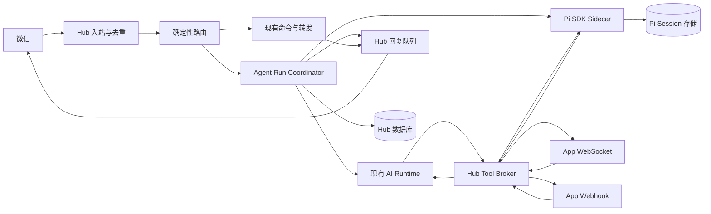

# Hub Agent 接入方案与详细设计

状态：设计草案，可用于实施评审；本文接口、配置项和数据表中标注“新增”的内容尚未实现。

## 1. 目标与结论

让微信用户通过自然语言使用当前账号安装的应用。例如“查一下项目的 PR，再把结论写到笔记”，由 Agent 选择 GitHub 和笔记应用、执行工具、综合结果，并由 Hub 回复微信。保留现有消息转发、显式 @应用、命令和 Apprise 通知能力。

推荐方案：复用现有 Go Hub AI 与应用体系，抽取统一 Tool Broker；新增 Node.js Pi SDK sidecar 作为可选 Runtime。Hub 管理身份、权限、工具执行、任务状态和微信投递；Pi 管理推理、模型上下文和工具循环。现有 OpenAI-compatible AI Runtime 保留，不强制迁移。

第一阶段只接入私聊文本、同步只读工具和稳定结果回传；第二阶段实现长任务恢复与写操作确认；再扩展群聊、媒体、受控技能。不把编码代理的 bash、文件读写、用户本机配置直接开放给微信消息。

## 2. 源码核对与前述判断修正

“当前只有转发，没有 Agent 循环”不符合源码。可能是部署没有配置模型、账号未启用 AI 或应用工具未暴露，而不是整个系统缺失 AI。部署诊断和 Pi 接入应分开处理。

| 能力 | 当前证据 | 设计结论 |
| --- | --- | --- |
| 模型请求、工具结果续推理 | `internal/ai/chat.go` 的 `CompleteMessages`、`ContinueWithToolResults` | 已有，复用 |
| 最多 5 轮工具调用 | `internal/sink/ai.go` 的 `reply`，`ai.MaxToolRounds` | 已有，不再叠加外层 LLM 循环 |
| 账号级 AI 开关和模型 | `internal/bot/manager.go` 的 `deliverToAI` | 扩展 runtime 配置 |
| 工具按安装实例隔离 | `collectTools` 使用 `installationID__tool_name` | 已有命名空间，改成服务端映射 |
| 应用级与安装级工具 | `internal/store/app.go` 两处 Tools；当前 AI collectTools 只读 App.Tools | 需要统一有效工具解析 |
| 应用调用 | `executeToolCall` 调用 `AppDisp.DeliverWithRetry` | 当前 AI 路径使用 webhook dispatcher，不等价于统一 WS 调用 |
| WebSocket 双向消息 | `internal/app/wshub.go` ReadPump 支持 ping、send | 缺少工具结果关联协议 |
| Webhook 同步/异步回复 | `internal/app/delivery.go`；3 秒 HTTP timeout、4 KiB 响应读取上限 | 保持兼容，新增结构化工具协议 |
| 异步完成 | `ReplyAsync` 意味着应用稍后直接给用户发消息 | 不应当成“Agent 已拿到最终工具结果” |
| 消息并发路径 | manager 中 AI 与应用投递均会执行，媒体路径也存在并行调度 | 需要回复所有权与去重 |
| 参数 schema | `ensureObjectSchema` 重建 schema，只保留有限字段 | 不能用它承担完整 JSON Schema 校验 |
| MCP | `/mcp` 仅接受 builtin MCP Server 安装 token | 普通自建应用不能直接作为统一 Pi MCP 网关 |

上线前先检查：全局模型配置是否有效、Bot AIEnabled 是否开启、模型是否支持工具调用、installation 是否启用、App.Tools / installation.Tools 是否实际可用。现有 AI 可以作为基线和回退路径。

## 3. 范围与非目标

### 第一阶段交付

- 每个 Bot 可选 `disabled`、`native`、`pi`，默认保留已有行为。
- 自然语言调用当前 Bot 的已授权应用工具；支持多个应用串行协作。
- Pi 会话按用户隔离、同会话串行、跨会话有限并发。
- 工具参数校验、工具结果关联、取消、超时、审计。
- 微信最终回复统一经过 Hub，发送时重新获取目标联系人的 context_token。
- 控制台提供配置、工具可用性和运行记录。

### 不在第一阶段

- 任意 shell、仓库修改、宿主机文件访问、自动加载第三方技能。
- 自由创建子 Agent、无限自主执行、后台计划任务。
- 自动理解所有媒体；图片、语音作为后续独立能力。
- 绕过微信发送窗口、保证 iLink 凭据永久有效。
- 任意应用通过 Apprise 文本触发管理操作。通知默认仅转发，不能自动提升为执行指令。

## 4. 架构与职责



| 模块 | 权责 | 不允许做的事 |
| --- | --- | --- |
| Inbound Router | 确认消息来源、去重、确定路由和回复所有者 | 把用户提供的 bot_id 当可信身份 |
| Run Coordinator | 排队、状态、预算、取消、关联最终结果 | 再包一层模型工具循环 |
| Runtime | 执行推理，产生工具请求和最终文本 | 直接访问微信凭据 |
| Tool Broker | 验证权限/schema、选择 transport、持久化结果 | 相信模型提供的 installation_id |
| App Adapter | 兼容现有 command、WS、Webhook 协议 | 将网络重试视为业务幂等保证 |
| Outbox | 发送前检查窗口和账号状态、记录结果 | 无条件重复发送未知结果 |

Pi 采用 TypeScript SDK 而非启动交互式终端。SDK 提供 createAgentSession、SessionManager、ResourceLoader、customTools、subscribe、abort 和 dispose。新增 HTTP 接口由本项目实现，不是 Pi 原生 HTTP API。

RPC 子进程是后续隔离选项：Pi RPC 是 stdin/stdout JSONL，不是网络 WebSocket；不能让微信用户直接访问完整 RPC 命令面。一次性 print/json 模式不适合作为主要会话服务。

## 5. 消息路由与回复所有权

按以下顺序执行，确定一个交互处理者：

1. 平台命令：取消、确认、会话重置等明确命令。
2. 显式 `@handle` 或已注册 `/command`：沿用直接应用调用，不进入自然语言 Agent。
3. 符合 Bot Agent 触发规则的普通私聊：创建 Agent run。
4. 其他消息：执行原有转发规则。

观察型消息订阅可以继续存在，但需与“允许回复/执行工具”的消费型订阅区分。新增 delivery_mode：`observe` 或 `consume`。Agent 处理消息时，观察订阅不应自动回复；旧应用迁移前保留 legacy 路由模式，不静默改变其契约。

每条消息持久化 `reply_owner = agent | installation | legacy`。同一 inbound message 只能创建一个对应的 Agent run。Agent 使用应用工具时，其结果进入 Agent，不能同时触发应用直接给微信发最终回复。

Apprise 等通知源默认走通知路由；只有管理员明确配置可信来源、允许工具和触发条件后，才能进入自动处理流程。

## 6. 会话与上下文

### 隔离键

使用结构化字段生成不可伪造的内部 conversation_id：

- 私聊：tenant_id + bot_id + provider + sender_id。
- 群聊后续支持：tenant_id + bot_id + group_id + sender_id，默认不共享个人上下文。
- 不使用昵称、handle 或用户提供的路径作为存储目录。

每个会话同一时刻最多一个 active run。消息在 Hub 持久队列中排队，不默认通过 Pi steer 打断前一任务。用户主动取消后才中止当前 run。

### 上下文权威来源

- Hub 数据库：消息、运行状态、工具调用、确认、最终回复的权威来源。
- Pi SessionManager：Pi 的模型上下文、压缩、工具消息顺序的权威来源。
- Hub 保存 session_ref、session_epoch、last_completed_run_id；不直接修改 `session.agent.state.messages` 来替代持久上下文。
- 当前消息只追加一次；已执行工具的结果恢复时引用 Tool Broker 日志，不重新执行。
- 历史只加载当前会话，不能直接复用可能混合 channel/联系人边界的查询而不校验隔离。

第一阶段 Pi 崩溃时将运行标记为 interrupted，保留已经执行的工具证据，不承诺任意中途恢复。第二阶段再引入 checkpoint 与 pending tool 恢复。会话重置增加 epoch，旧 session 不再接收新消息。

## 7. 工具注册、发现与路由

### 有效工具集合

新增统一 `ResolveEffectiveTools(installation)`，供 native 与 Pi 共用：

1. 加载已启用且属于当前 Bot 的 installation。
2. 合并 App.Tools 与 installation.Tools；同名安装级定义覆盖应用级定义，结果记录来源。
3. 过滤 Bot allowlist、联系人策略、工具启用状态和 transport 能力。
4. 校验名称与 JSON Schema；保留 required、enum、additionalProperties 等约束。
5. 生成 catalog_version 和 schema_hash。

UI 名称可用 `github.list_prs`；模型工具名使用跨 provider 兼容的短名称，如 `app_ab12_list_prs`（字母、数字、下划线，限制长度）。Hub 保存名称到 installation/tool/schema_hash 的映射，不解析模型字符串直接选租户。

在每次实际执行时重新检查 installation 是否启用、是否仍属于当前 Bot，以及工具是否仍存在。工具目录是授权快照，不是永久授权；schema 变化返回 `catalog_changed`，不悄悄执行不同参数契约。

### 工具选择

第一阶段直接向模型提供当前授权工具集，建议上限 40 个；超限时提示缩小 allowlist，不静默遗漏。后续加入只读 `discover_tools`，先按应用描述检索，再加载工具。模型仍只能选择 Hub 返回的工具。

工具说明应说明“何时使用、必需参数、返回内容和副作用”，例如：

```json
{
  "name": "list_prs",
  "description": "查询指定仓库的 Pull Requests；不创建或修改数据",
  "parameters": {
    "type": "object",
    "properties": {"repo": {"type": "string"}},
    "required": ["repo"],
    "additionalProperties": false
  },
  "execution": {"effect": "read", "idempotent": true}
}
```

execution 为拟新增元数据。未声明 effect 的旧工具默认 unknown，需要显式授权，不从名称猜测它是只读工具。message:write 是微信发送权限，不能据此推断“允许创建日历/删除文件”等业务权限。

## 8. Runtime 接口与 Pi 实现

拟新增 Go 边界（示意，不是已编译代码）：

```go
type Runtime interface {
    Start(ctx context.Context, req RunRequest) (RunHandle, error)
    Cancel(ctx context.Context, runID string) error
    Health(ctx context.Context) error
}
```

RunRequest 包含 run_id、conversation_id、session_epoch、规范化文本、模型 profile、系统提示版本、工具目录、deadline 和预算。认证能力通过 Header 传递，不进入模型消息。

Pi sidecar 实现要点：

- 使用固定版本 SDK 和 lockfile；对 customTools.execute 的真实类型签名编译验证。
- 显式设置 cwd、agentDir、模型、SessionManager 和自定义 ResourceLoader。
- `tools` 设为空，只注册 Hub 动态工具；不加载默认 bash/read/write/edit，也不从宿主机自动发现 extensions、AGENTS.md、skills 或个人凭据。
- 根据服务端 schema 构造 customTools；执行回调只调用固定 Hub Tool Broker 地址。
- 同一会话的运行互斥；并发配置限制整体会话数。
- subscribe 在 prompt 前注册；以 prompt 完成及 agent_settled 判断稳定完成，不能把 agent_end 当最终完成。
- 断开 SSE 只影响观察，不重复 prompt；取消调用 abort，释放资源调用 dispose。
- 普通微信消息中的 `/` 指令不得进入 Pi 扩展命令执行面；资源加载器无扩展和 prompt templates，并在契约测试中验证原始文本语义。
- 不向微信或普通日志发送模型内部推理字段，仅输出公开答复、工具摘要和用量。

## 9. 新增 Hub ↔ Runtime 协议 v1

仅内网监听，由服务身份认证；部署跨主机时使用 TLS。服务密钥与模型密钥分离，支持轮换。

| 方法 | 路径 | 行为 |
| --- | --- | --- |
| GET | `/healthz` | 进程存活 |
| GET | `/readyz` | 模型配置、会话存储可用 |
| POST | `/v1/runs` | 幂等创建，返回 202 和 run_id |
| GET | `/v1/runs/{id}` | 状态与最终公开结果 |
| GET | `/v1/runs/{id}/events` | SSE，支持 Last-Event-ID |
| POST | `/v1/runs/{id}/cancel` | 幂等取消 |

创建示例：

```json
{
  "protocol_version": 1,
  "run_id": "run_01",
  "conversation_id": "conv_01",
  "session_epoch": 1,
  "input": {"message_id": "msg_01", "text": "查询项目 PR"},
  "model_profile": "default",
  "catalog_version": "cat_01",
  "tools": [],
  "limits": {"max_tool_calls": 8, "timeout_ms": 90000}
}
```

tools 实际请求包含授权工具 schema，示例省略。90 秒为默认值建议，支持管理员设置，不假定所有 Agent 能在 10 秒内完成。

事件统一 `{seq, run_id, type, timestamp, data}`，类型包括 run.started、text.delta、tool.started、tool.completed、usage.updated、run.completed、run.failed、run.cancelled。终态持久化后才发布完成事件；序号递增。重复 run_id 同 payload 返回已有运行，不同 payload 返回 409。

Hub 不逐 token 给微信发消息。可在运行超过 5 秒后发送一次简短处理提示，最终文本通过 outbox 发送，失败明确告知。

## 10. Tool Broker 与应用结果协议

### Pi → Hub（新增内网接口）

`POST /internal/agent/v1/runs/{run_id}/tool-calls`

```json
{
  "call_id": "call_01",
  "tool_name": "app_ab12_list_prs",
  "catalog_version": "cat_01",
  "arguments": {"repo": "Mr-ChenH/openilink-hub"}
}
```

Header 使用短期 run capability：绑定 run_id、tenant、Bot、工具集、到期时间和 audience。请求不能指定任意回调 URL。服务身份与 run capability 都要验证。

Hub 返回 200 的持久化结果，或 202 加 call_id；Runtime 通过受鉴权的 `GET /internal/agent/v1/runs/{run_id}/tool-calls/{call_id}` 等待终态。第一阶段只支持短同步结果，第二阶段扩展长等待与确认。

### Hub → App

兼容旧 `command` envelope；对于声明支持 `agent-tools-v1` 的应用，在 event.data 增加：

```json
{
  "command": "list_prs",
  "args": {"repo": "Mr-ChenH/openilink-hub"},
  "sender": {"id": "user_01", "role": "agent"},
  "run_id": "run_01",
  "tool_call_id": "call_01",
  "idempotency_key": "call_01",
  "reply_mode": "tool_result"
}
```

仍使用原有 v=1、type=event、installation_id、bot、event、trace_id envelope。trace_id 是整条链路关联，不能替代唯一 tool_call_id。

- 有声明能力的 WS 连接优先：注册 waiter 后发送，避免快速结果丢失。
- 否则使用 Webhook：传播 context；沿用签名验证机制。
- 旧 HTTP 应用返回 reply，适配为文本结果。
- 旧 reply_async 归类为 `external_reply_pending`，结束本次 Agent 续推理且不重复最终回复；不支持后续依赖步骤，应明确提示能力不足。
- 旧 WS 仅支持 send 的应用不能假装支持 Agent tool_result，应显示“不支持工具结果回传”。

### App → Hub（新增）

WS 消息或 `POST /bot/v1/tool-results`，使用该 installation 的 app_token：

```json
{
  "type": "tool_result",
  "run_id": "run_01",
  "tool_call_id": "call_01",
  "status": "succeeded",
  "output": {"items": [{"number": 25, "title": "Fix reconnect"}]},
  "text": "找到 1 个 PR"
}
```

回传不需要 message:write，因为不是主动发微信；但必须匹配 call 的 installation 和仍有效的执行授权。应用级 WS 回传也必须绑定所属 installation。首次结果原子写入；同内容重复返回成功，不同内容重复返回 409。迟到结果保留审计，不唤醒已取消 run。

工具结果限制默认 32 KiB，大结果转为受授权 artifact 引用。现有 4 KiB 普通 Webhook 回复限制不直接取消。错误使用稳定 code（invalid_arguments、permission_denied、app_unavailable、timeout、execution_unknown 等）和可读摘要。

## 11. 状态机、幂等与恢复

Run 状态：queued → running → waiting_tool / waiting_confirmation → running → completed；另有 failed、cancelled、interrupted 终态。

Tool call 状态：created → authorized → dispatched → succeeded / failed / timed_out / unknown；confirmation 前可进入 awaiting_confirmation。

- 唯一约束 `(bot_id, inbound_message_id, run_kind)` 防止重复入站创建运行。
- 唯一约束 `(run_id, call_id)`；同 ID 参数变化拒绝。
- 只读或明确幂等工具可有限重试，保持同一 idempotency_key。
- 写工具超时不代表未执行：进入 unknown，不盲目走 WS→Webhook fallback 或 DeliverWithRetry。
- App 若不支持幂等，Hub 无法承诺 exactly-once；控制台需显示“执行结果未知”，由用户核实后决定。
- Hub 重启先恢复记录再接受回传；Pi 重启不自动重放有副作用的调用。
- 租约过期与 fencing token 防止两个 worker 同时执行同一 run。
- 微信发送 outbox 与工具执行分别记状态：工具成功但窗口过期为 delivery_blocked，不把业务成功改成工具失败。

## 12. 权限与确认

权限链：登录用户拥有 Bot → Bot 启用 Agent → 当前联系人允许触发 → installation 启用 → 工具在 allowlist → 参数通过 schema → 副作用策略允许。

工具副作用分 read、write、destructive、unknown；管理员可以按工具配置 allow、confirm、deny。第一阶段仅自动运行显式声明并获授权的 read 工具。应用作者的风险声明是参考，租户管理员策略优先。

确认采用一次性短码，例如“确认 A7K2”，绑定 conversation_id、run_id、call_id、参数 hash、到期时间和 sender。参数修改必须重新确认；普通“确认”不匹配任意待处理任务。拒绝/超时/取消使授权失效。

工具返回内容、网页、通知正文都按不可信数据处理，不能修改工具白名单、系统提示或授权策略。模型提示不是权限边界，所有检查在 Go 执行入口完成。

## 13. 数据模型与迁移

复用现有 users、bots、app_installations、messages、trace/span。拟新增表：

| 表 | 关键字段与约束 |
| --- | --- |
| agent_profiles | id、owner_id、runtime、model_profile、prompt_version、limits、enabled |
| bot_agent_settings | bot_id unique、profile_id、routing_mode、trigger_policy、tool_policy |
| agent_conversations | id、tenant_id、bot_id、sender_id、group_id、session_ref、epoch；隔离键唯一 |
| agent_runs | id、conversation_id、inbound_message_id、status、runtime、catalog_version、deadline、lease_owner、lease_until、fence、error_code |
| agent_tool_calls | id、run_id、installation_id、tool_name、args_hash、schema_hash、status、attempt、result_ref；run/call 唯一 |
| agent_confirmations | id、call_id、sender_id、code_hash、args_hash、expires_at、used_at |
| agent_run_events | run_id、seq、event_type、sanitized_payload；run/seq 唯一 |
| agent_outbox | id、run_id、recipient、content_ref、status、provider_client_id；最终回复逻辑键唯一 |

SQLite/PostgreSQL 同时迁移，并实现 store 接口和 memstore 测试替身。时间统一 UTC。run/tool result 不记录明文 token。事件与内容保留期可配置，默认建议 30 天；删除会话同步清理 Pi session 引用与内容，保留必要的最小执行审计。

## 14. 控制台设计

### 账号 → Agent

- 启用开关，runtime 下拉（现有 AI / Pi）。
- 模型 profile、系统提示、触发模式、超时和调用预算。
- 应用工具列表：应用名、工具名、来源、描述、effect、是否授权、transport 是否在线。
- 连接测试分别显示 Hub↔Pi、模型认证、工具投递；不以一次 healthz 代替全链路验证。
- “模拟消息”只生成选择与参数预览；有副作用的真实执行必须走相同授权入口。

### 应用安装 → Agent 接入

显示 effective tools 和 JSON Schema 错误、是否支持 agent-tools-v1、WS 在线状态、Webhook 验证、最后工具调用。提供 tool_result 示例与当前安装相关地址。

### 运行记录

展示消息、所选应用、工具参数摘要、状态、耗时、用量、错误和最终回复。提供取消、会话重置、结果未知核实入口。只读展示模型公开说明，不显示内部思维链或凭据。

## 15. 部署与配置

新增 `services/pi-agent/`（TypeScript）、独立 Dockerfile 和镜像。Hub 镜像仍为 Go 服务；Pi 仅通过内部网络访问，不映射公网端口。

以下是目标 Compose 结构，镜像和环境变量需随实现落地，不能直接视为现有可用配置：

```yaml
services:
  hub:
    image: ghcr.io/mr-chenh/openilink-hub:<version>
    environment:
      AGENT_PI_URL: http://pi-agent:8080
      AGENT_SERVICE_TOKEN_FILE: /run/secrets/agent_service_token
    secrets: [agent_service_token]
  pi-agent:
    image: ghcr.io/mr-chenh/openilink-pi-agent:<version>
    expose: ["8080"]
    environment:
      HUB_AGENT_BASE_URL: http://hub:9800/internal/agent/v1
      AGENT_SERVICE_TOKEN_FILE: /run/secrets/agent_service_token
    secrets: [agent_service_token]
    volumes:
      - pi-sessions:/var/lib/pi-agent
    read_only: true
    tmpfs: [/tmp]
    restart: unless-stopped
volumes:
  pi-sessions:
secrets:
  agent_service_token:
    file: ./secrets/agent_service_token
```

合并到当前真实 Compose，保留现有数据库卷与参数，不照抄猜测数据库环境变量。Pi 容器以非 root 用户运行，显式指定可写 session 目录；不挂载宿主机 home、SSH key 或 Docker socket。

模型凭据由 runtime profile 的秘密存储管理；第一阶段可以服务级部署一个模型账户，租户独立密钥作为后续功能。不把模型 key 放到 prompt/run JSON 中。

## 16. 性能与可观测性

建议初始预算：每会话 1 个活动 run、全局 4 个、每 Bot 2 个；排队上限 20；run 90 秒；单工具 15 秒；每 run 最多 8 次调用、5 轮。以上可调，模型 token 预算由 adapter 映射，实际费用采用模型账单用量计算，不能承诺精确硬截断。

复用 trace_id，增加 run_id、call_id。记录排队、模型、工具和微信投递耗时。指标包括失败率、权限拒绝、重复回传、未知执行、窗口阻塞、runtime 重启、调用数和 token 用量。

Pi 会话空闲后释放实例，持久状态可再加载；不无限保留所有 AgentSession 在内存。后续并行工具仅允许独立只读工具，第一阶段串行降低竞态。

## 17. 测试与验收

| 场景 | 验收条件 |
| --- | --- |
| 普通问答 | 不调用无关工具，单次最终回复 |
| 单工具查询 | 选择正确 installation，参数满足 schema |
| 跨应用任务 | 查询结果供第二应用使用，顺序正确 |
| 同名工具、多 Bot | 不串实例、不串租户 |
| 安装级 tools | 覆盖规则正确，变更后目录版本刷新 |
| WS 回传 | 快速/乱序/重复/迟到结果均正确关联 |
| legacy reply_async | 不谎称拿到结果，不重复回复 |
| 显式 @ 与 Agent | 只有指定回复所有者执行交互 |
| 写操作超时 | 标记 unknown，不自动重复写 |
| 权限中途撤销 | 尚未派发调用立即被拒绝 |
| 确认 | 跨联系人、过期、重复、参数变更均不能通过 |
| 断线重连 | 观察事件不重复 prompt，不重复业务动作 |
| 重启 | 第一阶段明确 interrupted；第二阶段按持久日志恢复 |
| 微信窗口失效 | 结果保留，显示 delivery_blocked |
| 恶意工具文本 | 不能启用 bash 或调用未授权应用 |
| Pi 原始用户文本 | 不触发扩展命令或读取宿主文件 |

Go 单元/集成测试覆盖 Broker、store、路由和 outbox；TypeScript 契约测试覆盖 Pi 事件终态、动态工具与会话隔离；用 mock 模型和两个 mock apps 做确定性端到端测试。真实模型测试单独运行并限制费用。CI 在 Linux 上验证 CGO 编译、前端、sidecar 和镜像；不再用 Windows 编译失败代替后端验证。

## 18. 实施任务与里程碑

| 阶段 | 任务 | 退出条件 | 估算人日 |
| --- | --- | --- | --- |
| P0 基线核验 | 配置诊断、现有 AI 工具测试、安装工具解析、schema 修复 | native 能稳定选对两个测试应用 | 2–3 |
| P1 工具执行边界 | 抽取 Broker、context、call 记录、同步 webhook、WS tool_result | 两种 transport 都返回结构化结果 | 4–6 |
| P2 Pi 最小链路 | SDK sidecar、私聊会话、只读工具、状态与取消、outbox | Pi 自然语言完成只读跨应用任务 | 4–6 |
| P3 产品入口 | Bot 配置、安装工具状态、运行记录、Compose/CI | 用户在 UI 配置并诊断接入 | 3–4 |
| P4 可靠性与写操作 | 幂等、确认、租约、checkpoint、长任务、恢复 | 故障注入无重复写、无跨用户恢复 | 5–8 |
| P5 扩展 | 群聊、媒体、工具检索、受控技能 | 独立评审与验收 | 单独估算 |

估算以熟悉项目的工程师为前提，不包括第三方应用自身改造和外部平台审批。P0–P3 形成可灰度只读版本，P4 完成后才开放需要可靠恢复的写操作。

建议代码布局：

```text
internal/agent/
  coordinator.go runtime.go router.go catalog.go
  broker.go policy.go outbox.go
  pi/client.go
internal/store/
  agent.go   # SQLite/PostgreSQL 对应实现和迁移
internal/api/
  agent_handler.go agent_internal_handler.go app_tool_result.go
services/pi-agent/
  src/server.ts src/runtime.ts src/session-pool.ts
  src/hub-tools.ts src/resource-loader.ts
  package.json Dockerfile
web/src/
  pages/bot-agent.tsx pages/agent-run-detail.tsx
```

避免一次性大重构：先让现有 AI 调用 Broker，保持原配置兼容；再接入 Pi。每阶段独立 PR，功能开关默认关闭；灰度限定测试 Bot 和工具 allowlist。

## 19. 发布与回退

数据库采用只增加字段/表的迁移，先部署兼容 Hub，再部署 sidecar，再开启测试 Bot。回退时关闭 Pi 或选择 native；已有运行先取消并记录，不能自动换 Runtime 重新执行已经产生副作用的任务。

旧 WebSocket send、普通 webhook reply、Apprise、显式命令的公开协议保持兼容。新 agent-tools-v1 通过能力协商开启。镜像发布分别固定 Hub/sidecar 版本，并记录 SDK 版本，禁止生产启动时安装 latest。

## 20. 资料与证据

仓库参考：

- [AI 请求和工具上下文](../internal/ai/chat.go)
- [已有 AI 编排和工具执行](../internal/sink/ai.go)
- [Bot 消息分发](../internal/bot/manager.go)
- [应用分发](../internal/bot/app_dispatch.go)
- [Webhook 协议实现](../internal/app/delivery.go)
- [WebSocket 协议实现](../internal/app/wshub.go)
- [应用工具模型](../internal/store/app.go)
- [现有开发指南](app-development.md)

Pi 核对来源为当前机器安装的 `@earendil-works/pi-coding-agent`：`docs/sdk.md`、`docs/cli-integration.md`、`examples/sdk/12-full-control.ts`。安装根目录为 `C:/Users/threeTeeth/AppData/Local/pi-node/current/node_modules/@earendil-works/pi-coding-agent/`。实施前应把实际采用版本写入 package.json，并按该版本的导出 TypeScript 类型核验；本文不把设计中的 HTTP API 当作 SDK 原生接口。
